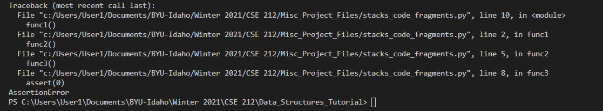

# Stacks
The stack is perhaps a lesser-known data structure characterized by the first in, last out principle. This refers to the order in which elements are added and removed, with the most recently added elements removed first, and the first elements removed last.  

There are software applications for which stacks are the clear container of choice. Some important examples are:

* Maintaining a history of actions, such as changes made to a text document
* Implementing a function stack (aka call stack) in software

We will discuss these in greater detail later on.

Stacks can easily be implemented in Python by creating a new list (i.e. `new_stack = []`) and using the built-in list operations. There is no special container type or keyword associated with stacks.  

After discussing these topics further, we will go over some example code which demonstrates the proper use of stacks. Additionally, you will be given a programming problem to solve on your own to test your knowledge. 

## First in, Last out Principle
So, what exactly what is the first in, last out (FILO) principle? An interesting way to think about it comes from the world of geology. The earth's crust is composed of many layers of deposited material, and can be thought of as a stack. Think about each of these layers as an element of the stack. The layers on the bottom, farthest from the surface, were formed and added to the stack first. As we approach the surface, the more recently-formed the layers are, with the surface itself being the final element added to the stack. 

  
*Just like elements in a stack, the layers at the bottom of the crust were added first and removed last*  

Well, that describes the "in" behavior, but how about the "out" behavior? The defining quality of a stack is this: the first element added is the last to be removed, and the last to be added is the first to be removed. This is an ideal time to introduce some additional terminology. In a stack, the location of the first element which was added is called the ***front*** of the stack, and the location of the last element added is the ***back***. In our geology example, the bottom of the crust, where the oldest layer can be found, is the front of the stack. The surface is the back. Knowing this, we can now say that elements are added and removed from the back of the stack. When we talk about "adding" elements to stack, we are referring to the stack's `push()` operation. When we talk about removing elements from the stack, this is done through the stack's `pop()` operation. These are both common programming terms, but as we will see later, Python implements these functions under different names. 

So how can we visualize this with our geology example? Well, if we want to deposit more material over millions of years to form a new layer, where does this happen? Can we deposit the material beneath the surface, perhaps miles and miles underground? Of course not! All the loose material which will comprise the new layer needs to collect on the surface, or rather, the back of the stack. Once layers have been added to the crust, do they remain there forever? Through the process of erosion, these layers can be removed from the crust, starting at the surface and working down. In some cases, such as when a river carves a path through the earth, we can better visualize what the stack looked like before its elements were removed. 

## Common Uses and Efficiency
There are a couple common situations in software in which stacks come in handy. If you recall from earlier, these were:  

* Maintaining a history of actions, such as changes made to a text document
* Implementing a function stack (aka call stack) in software  
    
Let's dive into these in further detail.  

### Recording Actions, and the "Undo" Feature
One scenario you are likely familiar with is the "undo" feature of most document editors. When you are creating or making changes to a document, the editor keeps track of all the changes you made, and stores them in a stack.  

  
*An example of a stack containing recent changes to a MS Word document*  

If you want to undo these changes, the most recent changes are reversed first. In other words, the first elements into the stack are the last out of it. 

### The Function Stack
Another scenario you are probably at least somewhat familiar with is the concept of a function stack in programming. This is a data structure which keeps track of the list of callers at any given point in the program execution. Take the following code, for example: 

```python
def func1():
    func2()

def func2():
    func3()

def func3():
    assert(0)

func1()
```  
When this code is run, the assertion will fire and this is what we see:  



This traceback displays information about exactly where we are in the program execution, with the list of all current function callers visible. In this case, when the assertion fired, the current order of function callers is: func3 -> func2 -> func1 -> \<module>.

### Efficiency Metrics
Stacks are very efficient data structures. In Python, stack performance is based on the performance of the dynamic array. All stack operations have constant O(1) efficiency, which means the size of the stack has no effect on code performance.

## Implementing Stacks in Python
It was mentioned before that stacks can be implemented in Python with a Python list and list operations.

Stack Operation | Python Code            | Description
----------------|------------------------|------------
push(value)     | my_stack.append(value) | Adds "value" to the back of the stack.
pop()           | value = my_stack.pop() | Removes and returns the item from the back of the stack.
size()          | length = len(my_stack) | Return the size of the stack.
empty()         | if len(my_stack) == 0: | Returns true if the length of the stack is zero.

## Example
Now, we will go over a simple Python program which uses stacks to simulate the forming and erosion of layers in the earth's crust. First we should identify some requirements:  

* Create a stack to represent the earth's crust.
* Write a function to add new layers to the earth's crust, in the proper order.
* Write a function to simulate erosion by removing some layers from the crust.
* Display the number of layers and the surface material before and after erosion.  

Below is a solution to this problem, which uses three stack operations in Python: `crust.append("layer name")`, `crust.pop()`, and `len(crust)`

```python
# Create a Python list. This will be our stack. 
crust = []

def form_layers(crust):
    """Add some layers to the earth's crust."""
    crust.append("basalt")
    crust.append("gabbro")
    crust.append("basalt")
    crust.append("shale")
    crust.append("slate")
    crust.append("coal")
    crust.append("rhyolite")
    crust.append("limestone")
    crust.append("sandstone")
    crust.append("shale")
    crust.append("sandstone")
    crust.append("conglomerate")

def erosion(crust):
    """Remove some layers from the earth's crust."""
    crust.pop()
    crust.pop()
    crust.pop()
    crust.pop()
    crust.pop()
    crust.pop()

# Form layers
# Display the number of layers and the surface material
form_layers(crust)
print(f"The crust has {len(crust)} layers.")
print(f"The surface material is {crust[len(crust) - 1]}.")

# Erode layers
# Display the new number of layers and the new surface material
erosion(crust)
print(f"\nAfter erosion, the crust has {len(crust)} layers.")
print(f"Now, the surface material is {crust[len(crust) - 1]}.")
```  

You should copy this code into your python editor and run it. Try making changes and experiment with the code to verify your understanding. 

## Problem to Solve  
To test your understanding of stacks and their implementation in Python, try solving this programming problem. 


[Return to Welcome Page](0-welcome.md)