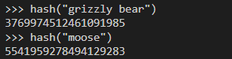
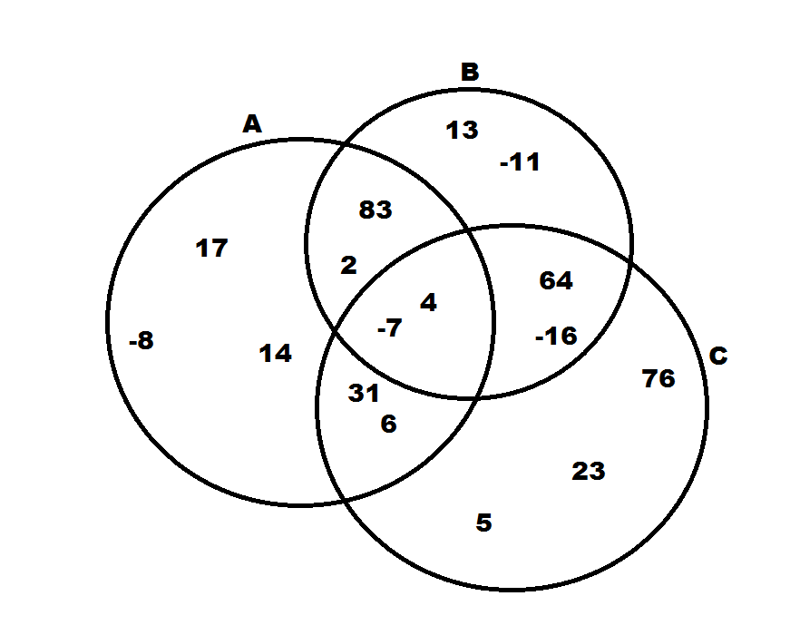
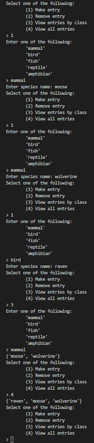

# Sets
The set is a data structure which is charactarized by the uniqueness of each of its elements. Unlike stacks, sets are not concerned with the *order* in which each element is added and removed. Instead, sets prevent duplicates, so each element appears in the set only once no matter how many times you try to add it.  

Sets use a technique call "hashing" which we will go over in further detail later. In short, this involves the use of a "hashing equation" which converts the value to be stored into an index. This index determines the location of the value in the set. 

Sets have excellent performance and find use in a variety of common applications. Some of these include:  

* Removing duplicates from a list
* Quickly storing and accessing results of computations
* Performing mathematical set operations (i.e. unions, intersections)  

New sets can be created in Python by using curly braces `my_set = {1, 2, 3}` or by using the **set** keyword `my_set = set()`. The Python `set()` contains built-in member funtions which implement the desired behavior. We will go over these in further detail later.  

After discussing these topics further, we will go over some example code which demonstrates the proper use of sets. Additionally, you will be given a programming problem to solve on your own to test your knowledge.

## Uniqueness Principle
Imagine you are a wildlife biologist who has been tasked with recording every *species* of wildlife on a section of forest in Alaska. Every time you encounter any individual animal, you are to enter the species of that animal into your field device. Since your objective is only to record all the species, but not the number of individuals in each species, the software on your field device will automatically remove duplicate entries and maintain a list of unique species names. Fortunately, since this is a remote section of forest in the interior, encounters with any wildlife will be rare and you will not spend all your time typing!  

  
*Even if this is not your first moose encounter, the set will maintain a single entry for "moose"*  

Of course, the ideal data structure in this example is the set. Every time you enter a species name into your field device, the software will attempt to add that name to the set. If the name is already in the set, it will not be added.  

Let's say after one week, you have encountered:  

* 2 moose
* 1 wolverine
* 4 beavers
* 10 ravens
* 1 grizzly bear
* 2 black bears
* 14 voles

Your set would look like this:  

`["black bear", "beaver", "grizzly bear", "moose", "raven", "vole", "wolverine"]`

## Hashing
Let's dive further into how a value gets added to a set. Does each new value get added to the back of the set, like a stack? Does it get added to the front, or maybe somewhere in between? How are values removed from a set? The answer lies in the concept of *hashing*. 

Let's start with a simple example. Say we have an array of length 5 which will hold the values 0-4. The possible index values are 0, 1, 2, 3, 4 and this corresponds perfectly with the value we want to store. So, the question is this: where should we store each value in the array? In this case, the answer is easy. It makes sense to store each value at its corresponding index location. When all our values are stored, our array will look like:  

`[0, 1, 2, 3, 4]`
                        
... and our hashing equation, or the equation which determines the appropriate index for each value, is:  

**index(n) = n**  

This is fairly straightforward. However, how about when our range of possible values is much larger? Let's say we only need to store, say, 5 values, but the range of possible values is 0-9999? Well, if we want to use the simple hashing equation above, we would need an array of length 10,000. As you can see, this strategy will quickly drain our memory resources. After all, we only need an array of length 5, not 10,000. Let's consider how we can alter our hashing equation.  

As an example, the 5 values we wish to store are 1000, 1001, 5003, 7002, and 8004. If we mod each of these values with 10, we will get a remainder which will be in the range 0-9. If we use this remainder as our index value, we can use an array of length 10 to store our values. While we really only need an array of length 5, not 10, this is a huge improvement over length 10000. After storing our values, the set will look like:  

`[1000, 1001, 7002, 5003, 8004,    ,    ,    ,    ,    ]`

... and our hashing equation would be:  

**index(n) = n % 10**

So, 1000 % 10 = 0 and would therefore go in index 0, 1001 % 10 = 1 and would go in index 1, and so on.  

A more general form of this hashing equation is:  

**index(n) = n % list_size**

... where "list_size" is the desired size of the set. Note that integers are not the only type that can be hashed. Doubles and strings can also be hashed, for instance. This is important in the context of our wildlife survey example. In Python, we can use the hashing function `hash(value)` to convert these other data types into an integer which can then be used in our hashing equation. 



### Conflict Resolution

You may be wondering, "What if I want to store multiple numbers which are unique, but get indexed to the same location?" This brings us to the topic of conflict resolution. There are two common ways to solve this problem:  

1. Open Addressing
2. Chaining

In open addressing, if we try to place a value in an occupied spot, this method would have us move to the next available spot. If that spot is also occupied, we will move to the next available spot. As you might guess, this could produce even more conflicts. 

In chaining, instead of trying to find a new spot for the value, we instead create a list of values at the location of the conflict. This prevents the accumulating conflicts we can get with open addressing. 

## Common Uses and Efficiency
There are a few common applications in software in which sets come in handy. If you recall from earlier, these were:  

* Removing duplicates from a list
* Quickly storing and accessing results of computations
* Performing mathematical set operations (i.e. unions, intersections)  

We will now explore these in a little more detail.  

### Removing duplicates from a list
We can iterate through a list an add each value to a set. The end result of this is a set with only the unique values from the list.  

Sets in Python also make it incredibly easy to quickly check whether a value is in the set. This can be done using the `in` keyword in Python. If we wanted to check for the value 50 in a set, we could write the following code. 

```Python
if 50 in my_set:
    # more code here
```

### Quickly Storing and Accessing Results of Computations
We can perform many computations and store the results in a set. If we only care about the unique results, and not occurances of each result, then the set works well and facilitates fast storage and retrieval. 

### Performing Mathematical Set Operations (i.e. Unions, Intersections)
Sets allow us to easily perform set operations, including:

* unions - all unique values found in any set
* intersections - only the unique values found in all sets

  

In this Venn diagram, a union of sets A, B, and C would include all the values in all three circles. An intersection of sets A, B, and C would only include the values in the overlap of all three circles, in the very center of the diagram. How about a union of sets A and B or an intersection of sets B and C? Make sure you understand this because it is an important application of sets in the worlds of mathematics and computer science.  

### Efficiency Metrics
Sets are very efficient data structures. In Python, set performance is based on hashing. All set operations have constant O(1) efficiency, which means the size of the set has no effect on code performance. The exception to this is when we start running into conflicts. In open addressing conflict resolution, the operation of searching for an open spot has O(n) performance. In chaining conflict resolution, the use of lists at conflict sites also results in O(n) performance. 

## Implementing sets in Python
The Python set has built-in functions which are designed to implement proper set behavior. 

Common Set Operation | Python Code          | Description
---------------------|----------------------|------------
add(value)           | my_set.add(value)    | Adds "value" to the set
remove(value)        | my_set.remove(value) | Removes the "value" from the set
member(value)        | if value in my_set   | Determines if "value" is in the set
size()               | length = len(my_set) | Returns the number of items in the set

## Example 
Returning to our wildlife survey example, what might the software on the field device look like? Here is an example of a simple program which allows the user to enter a species name, and records it only if hasn't previously been seen. We will also allow the user to remove an entry (maybe it was a false ID) and view all entries.

```Python
# This set will hold all unique species names
species_seen = set()

# This will loop indefinitely
while True:

    print("Ready for new entry... \n")

    # Get new entry
    species = input("Enter species name: ")
    if species in species_seen:
        print("Species already seen. Not added.")
    else:
        species_seen.add(species)

    # Allow the user to remove a prior entry
    if "y" in input("Would you like to remove a prior entry (y/n)? ").lower():
        species_to_remove = input("What entry would you like to remove? ")
        if species_to_remove in species_seen:
            species_seen.remove(species_to_remove)
        else:
            print("ERROR: invalid entry.")
    
    # Allow the user to view all entries
    if "y" in input("Would you like to view all seen species (y/n)? ").lower():
        print(species_seen)
```

Note the use of Python's `add()`, `remove()`, and `in` set operations. Also note the code `if "y" in input(...)` which we have used before, and which you should now recognize as a set operation.

## Problem to Solve - Wildlife Survey
Now, let's build off the progress we made in the previous example. You must build a program with the following functionality:

* Allow the user to specify the class (mammal, bird, fish, reptile, amphibian)
* Keep a seperate set for each class
* Keep a set with *all* species, from every class
* Allow the user to enter the species name
* If the species has already been seen, notify the user but don't record it
* Allow the user to see the contents of any class set
* Allow the user to see *every* species seen, from every class
* Loop indefinitely, with an options menu

Here is some sample output:

  

When you are done, please compare your code to a possible solution [here](wildlife_survey.py).

[Return to Welcome Page](0-welcome.md)