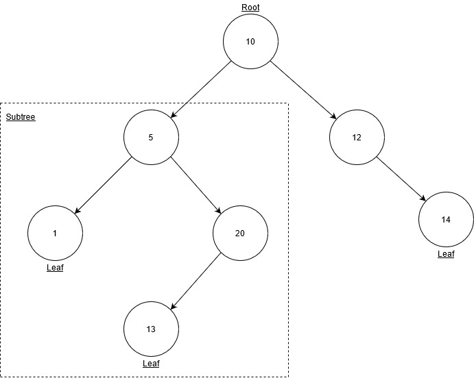

# Trees
Trees are more complex mannifestations of linked lists, being composed of nodes which are connected by pointers. Unlike linked lists, nodes in trees can connect to multiple other nodes, forming a tree-like structure. There are multiple types of trees, such as the **binary tree**, the **binary search tree (BST)**, and the **balanced binary search tree**. Among these, the BST and balanced BST are of the most interest to us. 

We will discuss common tree operations, the efficiency of these operations, and how to implement trees in Python. 

We will then go over an example of using a BST to solve a programming problem. Finally, you will be presented with a problem to solve to test your understanding of trees. 

## Overall Structure
Let's start by going over some useful terminology. 

* Node - an element in a tree which contains a value, as well as any pointers to child nodes
* Child - a child is a node connected from a parent node
* Parent - a parent is a node that is connected to children nodes
* Root - the first parent in a tree
* Leaf - a node that has no children
* Subtree - subset of a tree made by selecting a node to be the root and including all the children from that node

Starting with this basic terminology, let's define a *tree* as *a data structure that starts with a root node and is made of branching subtrees which ultimately terminate at leaf nodes*. 

We should also properly define the three types of trees mentioned earlier. These were, in order of increasing complexity:

1. Binary tree - a tree that has two children for each node
2. Binary search tree - a tree that sorts values less than the root to the left, and values greater than the root to the right
3. Balanced binary search tree - a BST which is structured to be balanced and therefore has O(log n) efficiency

In other words, a *balanced binary search tree* is a *binary search tree*, which in turn is a *binary tree*, which is a *tree*.  

        balanced binary search tree -> binary search tree -> binary tree -> tree

When trying to visualize the *data structure* tree, it might be useful to picture an upside-down tree, with its roots on top and its leaves on the bottom.  

  
*The "root" of this tree is at the top, and branching "subtrees" descend from it which terminate at the leaves*  

Compare that with this diagram of the binary tree data structure.  

   
*binary tree data structure*

## Recursion in BST Operations
BST operations are recursive in nature. It is assumed you have a working knowledge of recursion and how use it in Python. Just remember, it's all about finding a base case (or stopping condition) for your recursive call, and simplifying the problem in some way with each call so you don't get stuck in an infinite loop. We will go over a couple tree operations, and how recursion is used to implement them. These operations will be:

1. insert()
2. contains()

### Insert() 
The `insert(value)` function will search the BST and insert the node containing the value at the proper location. This code fragment will show you how this can be implemented in Python. 

```Python
def insert(self, data):
        """
        Inserts a node containing the value into the BST. If the BST has no root 
        (is empty), then the new node is assigned to be the root."""
        if self.root is None:
            self.root = BST.Node(data)
        else:
            self._insert(data, self.root)  # Start at the root
```

This is the actual function the user would call. Notice that it first checks whether the tree has a root. If it doesn't, the tree is empty and the new node will become the root. If there is already a root, we will call our recursive function `_insert(data, node)`.

Now we will look at the code for the recursive function. 

```Python
def _insert(self, data, node):
        """
        Called for the first time by insert(). This is a recursive function
        which looks for a place to insert a value into the BST, and inserts
        it when an available location is found."""
        ###########################
        # Left side
        ###########################
        if data < node.data:
            # The data belongs on the left side.
            if node.left is None: # <-------------------- BASE CASE
                # We found an empty spot
                node.left = BST.Node(data)
            else:                 # <-------------------- RECURSIVE PART
                # Need to keep looking.  Call _insert
                # recursively on the left sub-tree.
                self._insert(data, node.left)
        
        ###########################
        # Right side
        ###########################       
        elif data > node.data:
            # The data belongs on the right side.
            if node.right is None:
                # We found an empty spot
                node.right = BST.Node(data)
            else:
                # Need to keep looking.  Call _insert
                # recursively on the right sub-tree.
                self._insert(data, node.right)
```

Don't let this confuse you. First, notice that there is code for the left side of the current node, and essentially repeat code for the right side of the current node. We only need to look at one of these sides, so let's choose left. Now we can break it down into two major components:

1. The base case
2. The recursive part

The base case is reached the value to insert is less than the value of the current node, and the current node has no left subtree. If this is not the case, then we need to look at the recursive part. We simply call `_insert(data, node)` again and pass it the left child of the current node. By passing the child node, we are simplifying the problem and ensuring we will eventually reach our base case. Note that the value is never actually inerted into the tree until we reach our base case. Let's take a look at another operation: **contains()**.

### Contains()
The `contains(value)` function will search the BST for the value passed to it and return `True` if found and `False` if not. You will now see how this is implemented in Python using recursion. 

```Python
def __contains__(self, data):
        """Supports use of the 'in' keyword.
        Checks if a value is in the BST."""

        return self._contains(data, self.root)  # Start at the root
```

This starts out even simpler than `insert()` did. Again, this is the function the user originally calls (note, however, that this function is invoked by the `in` keyword). Unlike before, there is no need to check for a root because if there is no root, then we know the tree doesn't contain the value we are looking for.  

Now for the recursive function...

```Python
def _contains(self, data, node):
        """
        Called for the first time by __contains__(), when the 'in' keyword is used.
        This is a recursive function which returns True if the data in the current 
        node matches the search value."""
        if node is not None:

            # Base case
            if data == node.data:
                return True

            # Recursive part:
            return self._contains(data, node.left) # Check left subtree
            return self._contains(data, node.right) # Check right subtree
```

This part is also simpler. You can clearly see the base case and recursive parts of this function. If the value we are searching for matches the data of the current node, then this function returns `True`. If not, we will recursively call this function on its children. From any given node, this algorithm will first search the entire left subtree before moving on to the right. If the value is never found, the base case conditional will never be satisfied and this function will never return `True`. 

## Implementation in Python
Now, lets review common tree operations in Python. This time, there will be no Python code equivalent since this data structure is not built in to Python and the code to make it work must be written by the developer. There *are* libraries written by other developers which can be installed and used in your code (an example is [bintrees](https://pypi.org/project/bintrees/)), but that can be something for you to further explore later. 

Common BST Operation | Description 	                                                                                  | Performance
---------------------|------------------------------------------------------------------------------------------------|------------
insert(value)        | Insert a value into the tree 	                                                              | O(log n) 	
remove(value) 	     | Remove a value from the tree 	                                                              | O(log n) 
contains(value) 	 | Determine if a value is in the tree	                                                          | O(log n)
traverse_forward 	 | Visit all objects from smallest to largest	                                                  | O(log n)
traverse_reverse 	 | Visit all objects from largest to smallest	                                                  |	O(log n)	
height(node) 	     | Determine the height of a node                                                                 | O(log n)	
size()               | Return the size of the BST 	                                                                  | O(1)
empty() 	         | Returns true if the root node is empty - can be done by checking if size == 0                  | O(1) 

Remember that these efficiency metrics are **for binary search trees only**, and really in many cases for **balanced binary search trees only**. When BST's get unbalanced, their performance takes a hit and approaches O(n) for many operations. 

## Example
Lets write a simple program which iterates through a list of numbers and inserts each value into a BST. Then, we will iterate through the original list of numbers and verify that each value is in the BST. Finally, we will find and display the height of the BST. The **height** of a tree is a new term which means the number of nodes we must pass through to get from the root to the farthest leaf (including the root and leaf nodes).

This will make use of the `insert()` and `__contains__()` functions we reviewed earlier. Additionally, we will need to write a new function, `get_height()` and its recursive counterpart `_get_height()`.

```Python

class BST:
    """Represents the binary search tree"""

    class Node:
        """Represents a node in the BST."""

        def __init__(self, data):
            """Initialize the node with the data passed to it and None type pointers."""
       
            self.data = data
            self.left = None
            self.right = None

    def __init__(self):
        """Initialize the BST by assigning its root to None type."""

        self.root = None

    def insert(self, data):
        """
        Inserts a node containing the value into the BST. If the BST has no root 
        (is empty), then the new node is assigned to be the root."""

        if self.root is None:
            self.root = BST.Node(data)
        else:
            self._insert(data, self.root)  # Start at the root

    def _insert(self, data, node):
        """
        Called for the first time by insert(). This is a recursive function
        which looks for a place to insert a value into the BST, and inserts
        it when an available location is found."""

        ###########################
        # Left side
        ###########################
        if data < node.data:
            # The data belongs on the left side.
            if node.left is None: # <-------------------- BASE CASE
                # We found an empty spot
                node.left = BST.Node(data)
            else:                 # <-------------------- RECURSIVE PART
                # Need to keep looking.  Call _insert
                # recursively on the left sub-tree.
                self._insert(data, node.left)
        
        ###########################
        # Right side
        ###########################       
        elif data > node.data:
            # The data belongs on the right side.
            if node.right is None:
                # We found an empty spot
                node.right = BST.Node(data)
            else:
                # Need to keep looking.  Call _insert
                # recursively on the right sub-tree.
                self._insert(data, node.right)

    def __contains__(self, data):
        """Supports use of the 'in' keyword.
        Checks if a value is in the BST."""

        return self._contains(data, self.root)  # Start at the root

    def _contains(self, data, node):
        """
        Called for the first time by __contains__(), when the 'in' keyword is used.
        This is a recursive function which returns True if the data in the current 
        node matches the search value."""

        if node is not None:

            # Base case
            if data == node.data:
                return True

            # Recursive part:
            return self._contains(data, node.left) # Check left subtree
            return self._contains(data, node.right) # Check right subtree

    def get_height(self):
        """
        Determine the height of the BST. The height of an empty tree will be 0, 
        and the height of a tree with a single node (root) will be 1."""

        if self.root is None:
            return 0
        else:
            return self._get_height(self.root)  # Start at the root

    def _get_height(self, node):
        """
        Determine the height of the BST. The height of a subtree is 1 plus
        the height of either the left or the right subtree (the larger of the two).

        This function will be called the first time by get_height."""

        # Base case
        if node is None:
            return 0
        # Recursive part
        # Use the height of the longer subtree (left or right)
        elif self._get_height(node.left) > self._get_height(node.right):
            return 1 + self._get_height(node.left) # left subtree
        else:
            return 1 + self._get_height(node.right) # right subtree


########################################
# TEST CODE
########################################

# Initialize a new BST and declare a list of values
tree = BST()
values = [1, 3, 5, 4, 6, 8, 7]

# Fill the BST with the values in the list
for value in values:
    tree.insert(value)

# Verify that every value from the list is in the BST
bool_list = []
for value in values:
    bool_list.append(value in tree)

# Display the results to the user
print(bool_list) # Should be [True, True, True, True, True, True, True]
print(f"The height of the BST is {tree.get_height()}.") # Should be 4
```

We can write any functions we want for our binary search tree! We can also write functions to iterate through our tree, like we would with an stack or a set. We can give our tree some of the advantages of a set by writing the necessary code in our `_insert()` function. The `BST()` class we've been working on already has the necessary code to implement the uniqueness feature. See if you can identify this code (HINT: it has to do with a conditional for the "right side"). 

## Problem to Solve
Remember the wildlife survey program from the [sets](2-sets.md) tutorial? Now we are going to implement the same functionality using a binary search tree. However, to simplify things somewhat, you are not required to implement the `remove()` function.

This means our `BST()` class will need code for the following operations:

* `insert()`
* `__contains__()` - support for the `in` function
* `__iter__()` - called when using loops

The BST will allow us to insert strings just fine, so don't worry about that. `__iter__` will allow us to traverse through the tree in order to display each value. Creating this function and its recursive counterpart `traverse_forward()` will be the biggest challenge here. You will want to move through every node, in order, and `yield` the value in that node. The `yield` keyword in Python allows you to return a value, as you would in any function, but pick up where you left off in the context of iterating through something. 

Remember, the program should function as it did before, minus the `remove()` function, only we are using a BST instead of a set to make it happen. 

When you are done, please compare your code to a possible solution [here](wildlife_survey_with_tree.py).

[Return to Welcome Page](0-welcome.md)